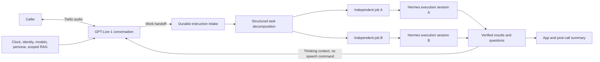

# Eli phone: conversation and independent work

## Verified baseline and change

The deployed phone already used GPT-Live-1 with Twilio bidirectional Media Streams
(PCMU, 8 kHz) and client delegation. Hermes was not in the audio transport. The
incomplete boundaries were compound instructions becoming one job, per-actor
execution serialization, shared Hermes conversation history, result delivery via
`session.commentary.append`, and scripted overlap/apology wording.

The September 21 rebuild keeps the working audio transport and changes those
boundaries. The voice model decides turn-taking and wording. No local volume gate,
programmed apology, or pending-task gate suppresses generated speech.

## Execution contract

1. GPT-Live answers from conversation, general knowledge and current authorized
   context. Date/time, model, identity and team delegations are intercepted locally;
   they create neither an intake nor a Hermes turn. Clock context refreshes each
   minute, with fresh clock data on a delegated clock question. The practice
   timezone is explicit rather than assumed to be the caller's location.
2. An actual instruction is saved transactionally before its acceptance receipt.
   A narrow prepared-read allowlist can go directly to the existing read worker.
   Other instructions enter durable decomposition outside the voice loop.
3. Client delegation contains metadata, not function arguments. A bounded
   GPT-5.6 Luna structured-output call in the work layer decomposes instructions;
   it has no execution tools. Exact caller quotations are validated against the
   captured instruction. Missing details are not authorization to invent them.
4. All children are inserted in one transaction, with stable identifiers, separate
   effect roots, scope, dependencies and resource keys. Text and email are distinct
   jobs and can be claimed concurrently. Draft/read jobs are independent; writes
   sharing a channel/resource serialize conservatively. Verified prerequisites
   travel as reference data, not instructions. Failed/uncertain prerequisites stop
   dependent work with an explicit result instead of leaving it queued forever.
5. Hermes receives one atomic scope in a separate conversation session for each
   root task. User identity and the existing permissions/persona/RAG hooks remain.
   A clarification continuation reuses its effect root and session. Existing
   provider-attempt ledgers, exact-action checks and readback remain authoritative.
6. Completion/questions become `session.thinking.append` context once per call.
   GPT-Live chooses whether and when they matter. The bridge cannot use commentary
   appends to force speech. Context delivery is not marked as human hearing.
7. Hangup closes audio, not accepted work. Planning leases can expire and retry
   because planning has no effects; atomic commit prevents duplicate children.
   Started or uncertain effects never automatically replay. App summaries retain
   results/questions. No callback is created without an explicit current request.

## Continuity and limits

The front layer loads the actual native character, rank, verified contacts and
authorized retrieval packet. Unchanged packets are not repeatedly reinjected.
Principal private retrieval remains principal-only. Phone archives still feed the
native evidence/learning path, and tool timing/failure feedback remains available
to Hermes. Operational feedback cannot change permissions or retry uncertain writes.

Known-team coverage is explicitly partial where only registered contacts are
authorized. Missing facts still require retrieval; no model can answer unavailable
private information instantly. PSTN audio remains narrowband and network-dependent.
iMessage's Mac endpoint remains disconnected at the operator's request. The voice
remains Marin because Sol was denied by this project's current Live API access.

Acceptance is not the same as completion. A provider's unknown outcome is held
for reconciliation rather than claiming universal exactly-once delivery. Planner
failure preserves a durable question after bounded retries, rather than falling
back to executing a compound request without decomposition.

## Validation

- Backend suite: 190 tests passed before final dependency/notices regressions were
  added; final release CI is the authoritative count.
- Installed native: 54 unit checks and 6 installed-adapter checks passed, including
  concurrent job sessions, caller identity, and restart/no-replay behavior.
- Native persona projection and scoped retrieval/evidence probes passed.
- Actual planner API: independent text/email, two drafts with shared no-send
  constraints, a local question, and a dependent lookup/reply all routed correctly.
  Observed planning time: 2.39-9.13 seconds, outside the voice loop.
- Actual GPT-Live rehearsal on the production host, using isolated storage and
  simulated task execution: simple model question answered, two separate draft
  jobs completed, topic pivot/correction followed, zero commentary appends, zero
  playback clears, and zero milliseconds of generated voiced audio dropped.
  This was synthetic audio, not a human phone acceptance call or real send.
- Human handset acceptance is pending deployment and the operator's call.

## Primary API references

- [GPT-Live delegation](https://developers.openai.com/api/docs/guides/live-delegation)
- [GPT-Live prompting](https://developers.openai.com/api/docs/guides/live-prompting)
- [Twilio compatibility](https://developers.openai.com/api/docs/guides/live-partner-integrations)
